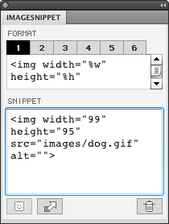

This is an Adobe Fireworks(FW) Extention source code.
ImageSnippet is generate snippet code in FW from selected slice info.

screen shot

The snippet code is formatted text that you wrote.

 format  | slice property's name
 ------------- | ------------- 
 %p    | name
 %w    | width
 %h | height
 %x | x
 %y | y
 

